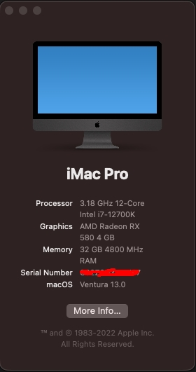

# MS-iCraft-Z690-WIFI-EFI
## Specification

| **Component**    | **Model**                                 |
| ---------------- | ----------------------------------------- |
| CPU              | I9-12900KF                                |
| Motherboard      | MS-iCraft Z690 WIFI                       |
| RAM              | 2xG.Skill 32GB DDR5 6000                  |
| Audio Chipset    | ALC1220                                   |
| GPU              | Sapphire RX 580 4G                        |
| Ethernet         | RTL8125  2.5GbE X2                        |
| WiFi & Bluetooth | Fenvi FV-T919 1750Mbps                    |

## Screenshot

